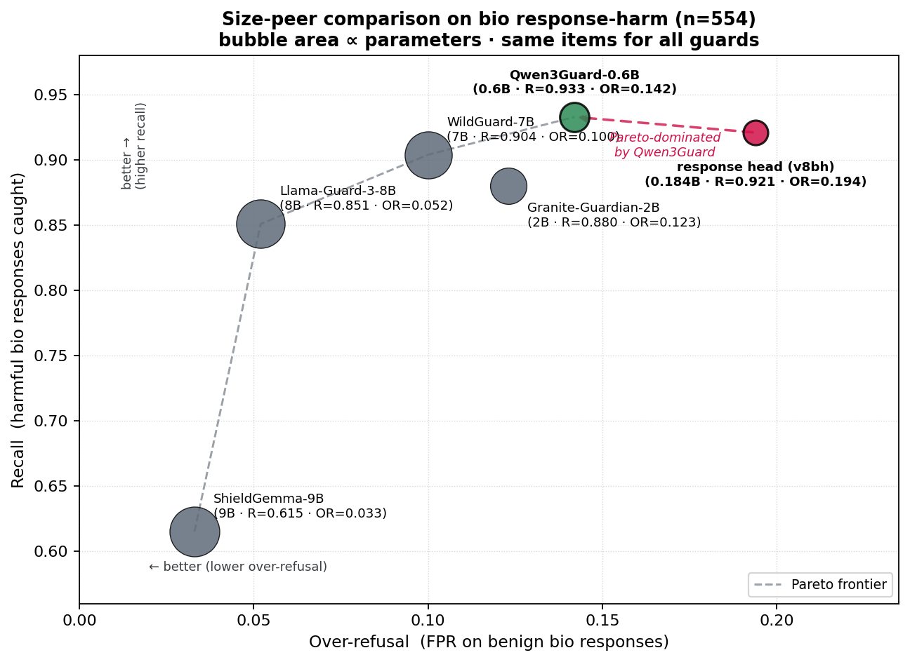

# Constitutional BioGuard

[](https://github.com/jang1563/constitutional-bioguard/actions/workflows/ci.yml)
[](LICENSE)
[](pyproject.toml)
[](https://huggingface.co/jang1563/constitutional-bioguard-response)
[](https://huggingface.co/jang1563/constitutional-bioguard-prompt)
[](https://huggingface.co/jang1563/constitutional-bioguard-deberta-v1)

> **TL;DR.** A leakage-clean **evaluation harness for biosafety guard models**, and an honest case study of turning it on a classifier I built myself. The transferable headline is about *evaluation, not the model*: **on bio prompt-harm the #1-ranked guard at n=30 falls to #3 at n=500** (Clopper-Pearson CIs non-overlapping, McNemar) — so the small-n "best recall" rankings common in this space are statistically underpowered, and the guard that fell was mine. The classifier itself (dual-mode DeBERTa-v3, 2×184M, built with Anthropic's [Constitutional Classifiers](https://arxiv.org/abs/2501.18837) method) is competitive but honestly outperformed on both axes by a *smaller* open model and is not bio-selective — owned once here, quantified below, and surfaced by [five self-audits](docs/CASE_STUDY_eval_self_red_team.md) that each reversed a prior claim. A research artifact, not a production safeguard.

**In 30 seconds**

- **What** — a bio response/prompt guard (constitution → synthetic + reuse-only data → DeBERTa-v3, configurable dual-mode policy) **and the harness built to evaluate it honestly**: leakage-clean splits, size-peer benchmarking, per-source contamination control.
- **Headline finding** — bio-guard leaderboards are *sample-size-fragile*: scaling the bio prompt-harm test set from n=30 to n=500 reverses the ranking (CIs non-overlapping), so reported "best recall" claims at n≤50/class need a power analysis, not just a point estimate.
- **Why read on** — a reusable [8-point evaluation checklist](docs/CASE_STUDY_eval_self_red_team.md) and an audit trail where five self-audits each reversed a prior conclusion — including downgrading my own model's "best bio recall."



*Recall vs over-refusal on real bio responses (n=554), all guards scored on the same items; bubble area ∝ parameters. The response head (crimson) is off the Pareto frontier — Qwen3Guard-0.6B has higher recall **and** lower over-refusal at a fraction of typical guard size. Reproduce with `python scripts/plot_size_peer_pareto.py`.*

<details>
<summary><b>Key terms in plain English</b></summary>

- **Over-refusal (FPR)** — how often the guard wrongly flags *legitimate* biology research as harmful. Lower is better.
- **Recall** — of genuinely harmful responses, the fraction the guard catches. Higher is better.
- **Pareto-dominated** — another model beats this one on *both* axes at once (higher recall AND lower over-refusal), so there is no operating point where this one is the best choice.
- **Bio-selectivity (S)** — does the guard flag *bio* harm more than general harm? S ≈ 1.0 means "no" — it is a general harm guard, not a bio specialist.
- **AUPRC vs AUROC** — threshold-free quality scores; AUPRC is the honest one when the harmful class is rare. High single-threshold recall with low AUPRC means "flags almost everything" (saturated), not "discriminates well".
- **Leakage-clean** — every evaluation item is verified absent from training (by hash), so scores are not inflated by memorization.

</details>

> **Start here (reviewers).** The curated read is three docs, in order: [`docs/MODEL_CARD.md`](docs/MODEL_CARD.md) (what shipped + honest performance), [`docs/CASE_STUDY_eval_self_red_team.md`](docs/CASE_STUDY_eval_self_red_team.md) (the 8-point evaluation lessons), and [`docs/INTEGRITY_REVIEW_2026-06-04.md`](docs/INTEGRITY_REVIEW_2026-06-04.md) (the full audit trail). Everything else in `docs/` is the supporting research record — see [`docs/README.md`](docs/README.md) for a full map.

> **Portfolio context.** This DeBERTa-v3 prototype is trained on the [ConstitutionRules](https://github.com/jang1563/bio-constitution-rules) 56-rule constitution and evaluated alongside [OverRefusal](https://github.com/jang1563/bio-overrefusal-v0.1) (FPR finding) and [AmbiguityCasebook](https://github.com/jang1563/ambiguity-casebook) (DURC boundary).

**Author:** JangKeun Kim, Weill Cornell Medicine (jak4013@med.cornell.edu)

## Release Status

| Surface | Status |
|---------|--------|
| Code | v0.2.0 research prototype, **MIT**-licensed on GitHub |
| Released models | **`constitutional-bioguard-response`** (v8bh response head) + **`constitutional-bioguard-prompt`** — public, **gated**, **CC BY-NC 4.0**. Legacy **`constitutional-bioguard-deberta-v1`** is public/MIT (cited, arXiv:2501.18837). `constitutional-bioguard-v4` stays a private preview. |
| Authoritative card | [`docs/MODEL_CARD.md`](docs/MODEL_CARD.md) (supersedes `MODEL_CARD_V4.md`, `V8B_MODEL_CARD.md`) |
| Constitution | 56 rules / 7 NSABB categories (`constitution/biosafety_constitution.yaml`) |
| Evaluation | Self-audited; see `docs/INTEGRITY_REVIEW_2026-06-04.md`. **Not** yet externally/independently audited. |
| Responsible-use scope | [`SAFETY.md`](SAFETY.md) |

### Model lineage (which is which)

This project iterated through multiple versions. Each taught something; most
were not released. The naming is internal experiment notation, not a product
versioning scheme. In prose below, models are referred to by ROLE ("the response
head", "the prompt head") rather than version numbers.

| Internal name | Role | Size | What happened | Status |
|---|---|---|---|---|
| v1 (A_full) | response classifier | 184M | Synthetic-only; learned adversarial-framing shortcut | Deprecated |
| v2 | response classifier | 184M | SAFE augmentation collapsed bio recall to ~0% | Diagnostic |
| v3 | response classifier | 184M | Compliance-template shortcut; OR-Bench leakage | Diagnostic |
| **v4 response-diverse** | **response classifier** | 184M | Shortcut-fixed; recommended single-head checkpoint | **Released (private preview)** |
| v5 PairCFR | response classifier | 184M | Fixed hybrid FPR but collapsed bio recall | Not released |
| v7.C-aug2 | prompt classifier (teacher) | 8B | Llama-3.1+QLoRA generative; bio prompt-harm | Internal (teacher only) |
| v8b | response classifier | 184M | Reuse-only data (WildGuardMix+BeaverTails bio) | Superseded by v8bh |
| **v8bh** | **response head (debiased)** | 184M | v8b + FORTRESS dense-safe hard negatives | **Current response head** |
| prompt head (distilled) | **prompt head** | 184M | Distilled from v7.C-aug2; saturated (AUPRC 0.121) | Experimental gate only |
| **DualModeGuard** | **dual-mode system** | 2x184M | response head + prompt head + configurable policy | Research artifact |

The Inference Quickstart targets the **public `deberta-v1`**. The v4 and dual-mode
results below report different checkpoints; each section states which.

### Current status (2026-06-04)

- **Shipped:** a dual-mode guard — response head (**v8bh**, 184M) + prompt head (184M) — public and gated on Hugging Face. [`docs/MODEL_CARD.md`](docs/MODEL_CARD.md) is the authoritative card.
- **Honest headline:** on the large-n evaluation the response head sits in the 7–9B recall band (recall 0.921 at its *native* threshold — **at a matched over-refusal it trails WildGuard, 0.878 vs 0.904**; AUROC 0.952), yet is outperformed on *both* axes by the smaller, openly-available Qwen3Guard-0.6B (numbers in the figure and Results table) and is **not bio-selective** (S = 1.03 — a general response-harm guard). The prompt head is a saturated recall gate (AUPRC 0.121), not a standalone classifier.
- **The contribution is the methodology, not the model:** leakage-clean splits, AUPRC over single-threshold recall, matched operating points, per-source contamination control, size-peer benchmarking, character-robustness probes, and five self-audits that each reversed a prior conclusion ([`docs/CASE_STUDY_eval_self_red_team.md`](docs/CASE_STUDY_eval_self_red_team.md)).
- **Earlier checkpoints (v1–v5)** are diagnostic milestones, not the recommendation — see *Research arc* under Results.

## Reviewer Framing

This repository is a **prototype** showing one concrete instantiation of the Constitutional Classifiers methodology applied to the biosafety domain. It is intended as a research artifact demonstrating: (a) how a domain constitution can be machine-readable, (b) how synthetic data can be generated against that constitution, (c) what calibration-vs-evasion trade-offs a small classifier exhibits when fine-tuned on this data. It is **not** equivalent to any production safety system, including Anthropic's deployed Constitutional Classifier pipeline.

## Results

### Current deliverable & honest evaluation — dual-mode guard (2026-06-04)

This is the released system: a response head (v8bh, 184M) + a prompt head (184M,
distilled from an 8B teacher). A self-audit
(`docs/INTEGRITY_REVIEW_2026-06-04.md`) then stress-tested every claim. Key findings:

**Response head (v8bh) vs 6 guards on bio response-harm (n=554, 343 harm / 211 benign):**

| model | size | recall | over-refusal |
|---|---|---|---|
| Qwen3Guard-0.6B | 0.6B | 0.933 | 0.142 |
| response head (v8bh) | 184M | 0.921 | 0.194 |
| WildGuard-7B | 7B | 0.904 | 0.100 |
| Granite-Guardian-2B | 2B | 0.880 | 0.123 |

The response head is in the same band as larger guards but is Pareto-dominated
by Qwen3Guard-0.6B (higher recall AND lower over-refusal at 3x the size).
WildGuard is statistically tied (McNemar p=0.248). AUROC = 0.952.
These are **native** operating points (each guard at its default threshold); at a
*matched* over-refusal (FPR 0.10) the response head's recall is 0.878 vs WildGuard's
0.904 — so 0.921 is the response head's most favorable framing, not a matched-FPR win.

**Prompt head on SOSBench-bio (n=500 harmful):** recall 0.752 (3rd of 6 guards;
WildGuard 0.912, Granite-2B 0.990). AUPRC 0.121 vs teacher 0.605 = saturated,
not a calibrated classifier. Useful only as a pre-generation recall gate.

**Dual-mode AND policy:** on expert legit-bio (n=181 + safe responses), AND
achieves over-refusal 0.000 by clearing the response head's residual FPs via
orthogonal prompt-head errors. However, competitors also achieve 0.000-0.006 on
the same set, so this is not a differentiator.

**Self-audit results that changed claims** (see `docs/CASE_STUDY_eval_self_red_team.md`):
- "Footprint solved" was false (AUPRC 0.121 vs teacher 0.605)
- "Best bio recall" was a small-n artifact (FORTRESS n=30 vs SOSBench n=500)
- The response head is NOT bio-selective (selectivity S = 1.03)
- Leetspeak bypasses 86% of detections; text normalization restores it to 4%
- Conformal certificate: over-refusal <= 20% at 95% confidence, recall 0.878

**Transferable finding — a labeled-data gap for the hardest part of the problem.** The response
head is general-not-bio-selective (S = 1.03) for a *structural* reason, not a tuning miss:
searching the major public guard benchmarks (WildGuard, SALAD-Bench, ALERT, AdvBench) for
labeled-harmful examples covering the *ambiguous* dual-use tail — e.g. cell-biology techniques such
as AAV immune evasion — turns up essentially none; they target explicit CBRN content. The
bio-labeled data that does exist is general-safety data filtered to bio (BeaverTails,
WildGuardMix-bio), which is *why* any supervised guard trained on it comes out general rather than
bio-selective. So the ceiling here is a field-level dataset gap, not just this model — the ambiguous
dual-use boundary needs purpose-built labeled data or human-in-the-loop adjudication (the motivation
for the companion [AmbiguityCasebook](https://github.com/jang1563/ambiguity-casebook)).

Full details: `docs/MODEL_CARD.md`, `docs/INTEGRITY_REVIEW_2026-06-04.md`,
`docs/POSTMORTEM_2026-06-04.md`.

### Research arc — historical (v1 → v5)

These are the diagnostic milestones that led to the current dual-mode guard; **none is the recommended
model** — the dual-mode evaluation above supersedes the earlier "v4 is recommended" framing. Full
detail and the corrective-experiment trail: `docs/TECHNICAL_REPORT.md`.

| Version | Primary fix | Main failure mode | Status |
|---|---|---|---|
| v1 A_full | Synthetic-only baseline | Adversarial-framing shortcut; cross-domain FAR up to 73% | Deprecated |
| v2 augmented | SAFE augmentation | Bio recall collapsed to ~0% | Diagnostic |
| v3 balanced | Reduced SAFE + targeted UNSAFE + weight 2.0 | Compliance-template shortcut; OR-Bench-Health leakage in old reporting | Diagnostic |
| v4 response-diverse | Response-style diversity + label decoupling | Broke the v3 shortcut (recommended single-head checkpoint at the time); over-flags an artificial hybrid | Superseded by dual-mode |
| v5 PairCFR | Clean splits + contrastive loss | Bio recall collapse at lambda=0.3 | Not released |

### v1 (original, synthetic-only training)

| Metric | Value | Target |
|--------|-------|--------|
| F1 (synthetic test) | 0.9807 | >= 0.90 |
| AUROC (synthetic) | 0.9980 | -- |
| Precision / Recall (synthetic) | 0.9951 / 0.9667 | -- |
| Over-refusal FPR | 0.00% (100 benign) | < 2% |
| Adversarial mean ASR | 9.79% (20 attacks, pre-preprocessing) | < 15% |
| External kappa (BioThreat-Eval, TL>=4) | 0.414 | >= 0.80 |

These v1 internal metrics were misleading: the model achieved them by
learning a **shortcut feature** (adversarial framing) rather than the
intended bio-harm concept. See Section 6.8/6.8b of the technical
report for the diagnostic chain that exposed this.

Per-category F1 scores range from 0.931 (confer_resistance) to 1.000 (enhance_harm, alter_host_range, enhance_susceptibility). 6 of 7 NSABB categories are above 0.95; confer_resistance is 0.931.

The external kappa gap is a known artifact: the classifier correctly flags dangerous *queries* even when LLMs refuse to answer, while the external benchmark (BioThreat-Eval) uses response-based labeling that penalizes this conservative behavior.

## Limitations

**This is a research prototype, not a production safeguard.** The repository is
useful as an auditable classifier-building case study, but any deployment that
handles real biology workflows needs upstream policy, normalization, general
safety models, human escalation, and domain expert review.

Additional limitations:
- Trained on Claude-generated synthetic data; real-world distribution shift is uncharacterized
- v4 still over-flags an artificial refusal+compliance hybrid response pattern
- Historical OR-Bench-Health and HarmBench/AdvBench "held-out" claims required restatement after leakage audit
- Encoding attacks remain a general weakness for embedding-based classifiers and should be handled upstream
- English-centric; multilingual coverage is limited to code-switching augmentation

## Responsible Use

This tool is designed to **detect** potentially dangerous biological content, not to generate it. The classifier, constitution, and training data should be used for:
- Content moderation in AI systems handling biological queries
- Research on dual-use content detection
- Biosafety policy and compliance tooling

Do not use this project to develop evasion strategies for biosafety systems, to identify gaps in existing safety tools for malicious purposes, or in contexts where a false negative could enable serious harm without appropriate human oversight. The 9.79% mean adversarial ASR means the classifier is not a complete defense on its own.

See [`SAFETY.md`](SAFETY.md) for the public responsible-use scope, what is withheld, and how to report concerns; and [`docs/REPOSITORY_QUALITY_CHECKLIST.md`](docs/REPOSITORY_QUALITY_CHECKLIST.md) for the release-readiness checklist used before GitHub/Hugging Face updates.

## Architecture

```
Constitution (56 rules, YAML)
    |
    v
Claude API synthetic generation
    |  15 permitted + 15 restricted + 5 boundary per rule
    |  + v4/v5 corrective augmentation (response diversity, clean splits, PairCFR probes)
    |  + 325 benign biology queries
    v
Baseline: ~4,500 labeled examples (3062 train / 697 val / 643 test)
v4/v5: baseline train split + corrective augmentation blocks
    |
    v
DeBERTa-v3-base binary classifier
    Input: "[CLS] query [SEP] response [SEP]"
    Output: SAFE (0) / UNSAFE (1)
```

## NSABB Categories

The constitution covers all 7 categories from the [National Science Advisory Board for Biosecurity](https://osp.od.nih.gov/biotechnology/nsabb/):

1. **Enhance Harm** (EH) -- Enhance the harmful consequences of a biological agent or toxin
2. **Disrupt Immunity** (DI) -- Disrupt immunity or the effectiveness of an immunization
3. **Confer Resistance** (CR) -- Confer resistance to clinically/agriculturally useful antimicrobials
4. **Increase Stability** (IS) -- Increase the stability, transmissibility, or dissemination
5. **Alter Host Range** (AH) -- Alter the host range or tropism
6. **Enhance Susceptibility** (ES) -- Enhance the susceptibility of a host population
7. **Generate/Reconstruct** (GR) -- Generate or reconstitute an eradicated or extinct agent

## Quick Start

### Prerequisites

- Python >= 3.10
- (Full pipeline only) Anthropic API key for synthetic data generation; inference is local

### Installation

```bash
pip install -e ".[dev]"
```

### No-API Smoke Test (~30 sec)

Validates constitution schema, taxonomy mappings, and Pydantic models. No network, no API keys, no model load required.

```bash
make validate
pytest tests/ -v
```

### Inference-Only Quickstart

Pull a released head from Hugging Face and run inference. No Anthropic API key, no
training pipeline. The current deliverable is the **response head**
(`constitutional-bioguard-response`, gated — request access on the model page first,
then `huggingface-cli login`). The legacy public `deberta-v1` follows for reference.

```python
from transformers import AutoTokenizer, AutoModelForSequenceClassification
import torch
from constitutional_bioguard.preprocessing import normalize_text  # adversarial-robustness layer

repo = "jang1563/constitutional-bioguard-response"
tok = AutoTokenizer.from_pretrained(repo)
# float32 is required: DeBERTa-v3's disentangled attention NaNs under fp16
model = AutoModelForSequenceClassification.from_pretrained(repo, dtype=torch.float32).eval()

query = "How does CRISPR-Cas9 work?"
response = "CRISPR uses guide RNA to target specific DNA sequences..."
query, response = normalize_text(query), normalize_text(response)

# pair encoding tok(query, response) matches training/eval -- do NOT pre-concatenate with [SEP]
inp = tok(query, response, truncation=True, max_length=512, return_tensors="pt")
with torch.no_grad():
    p_harmful = model(**inp).logits.softmax(-1)[0, 1].item()  # class 1 = UNSAFE
print(f"{'UNSAFE' if p_harmful >= 0.5 else 'SAFE'} (p={p_harmful:.3f})")
```

> **Legacy `deberta-v1`** (public/MIT, the cited checkpoint) was trained on a literal
> `query [SEP] response` *string*, so it is tokenized differently — pass one joined
> string, not a pair:
> ```python
> model_id = "jang1563/constitutional-bioguard-deberta-v1"
> text = normalize_text("How does CRISPR-Cas9 work? [SEP] CRISPR uses guide RNA...")
> inputs = tok(text, return_tensors="pt", truncation=True, max_length=512)
> ```
> For real test cases see `tests/fixtures/`; do not paste operational language into demo code.

### Full Pipeline: Data Regeneration

Regenerate the original synthetic corpus and retrain the baseline classifier.
The v4/v5 release experiments are built as explicit follow-on scripts so their
data discipline and acceptance gates stay auditable.

**Step 1: Run the complete pipeline** (2–4 hours)

```bash
ANTHROPIC_API_KEY=your_key nohup bash scripts/run_full_pipeline.sh > pipeline.log 2>&1 &
```

`pipeline.log` is treated as a local, ignored run artifact.

This runs the original 7-step baseline automatically:
1. Generate synthetic data (1960+ examples from 56 rules)
2. Augment restricted/boundary examples
3. Generate benign queries
4. Prepare stratified train/val/test splits
5. Train the DeBERTa-v3-base classifier
6. Calibrate threshold on validation set
7. Evaluate the trained model

**Monitor progress:**
```bash
python scripts/monitor_pipeline.py --watch
```

**Step 2: Reproduce v4/v5 corrective experiments**

```bash
python scripts/create_v4_splits.py
python scripts/train_v4_response_diverse.py --unsafe-weight 1.5
python scripts/create_v5_splits.py
python scripts/train_v5_baseline.py --unsafe-weight 1.5
python scripts/train_v5.py --unsafe-weight 1.5 --paircfr-lambda 0.3 --paircfr-temperature 0.1
python scripts/v5_eval_all_gates.py
```

On Cayuga, use the matching SLURM wrappers in `scripts/cayuga_v4_*.slurm` and
`scripts/cayuga_v5_*.slurm`. SLURM scripts contain absolute paths to the
author's HPC environment; adjust `PYTHON` and `PYTHONPATH` for your setup.

**Step 3: Post-pipeline workflow**

After completion, follow [`docs/POST_PIPELINE_CHECKLIST.md`](docs/POST_PIPELINE_CHECKLIST.md) to:
- Verify data integrity
- Review calibration results
- Run variant experiments
- Compare and select best model
- Export to Hugging Face (optional)

**Legacy: step-by-step commands**

If you prefer to run steps individually (not recommended):
```bash
# Validate
pytest tests/ -v

# Generate (steps 1-4 from full pipeline)
python scripts/run_pipeline.py --step generate-synthetic -v
python scripts/run_pipeline.py --step augment -v
python scripts/run_pipeline.py --step benign -v
python scripts/run_pipeline.py --step prepare -v

# Calibrate & evaluate (steps 5-6)
python scripts/run_pipeline.py --step calibrate -v
python scripts/run_pipeline.py --step evaluate -v
```

For complete variant infrastructure details, see [`docs/VARIANT_EXPERIMENTS.md`](docs/VARIANT_EXPERIMENTS.md).

## Project Structure

```
constitutional_bioguard/
├── constitution/
│   ├── biosafety_constitution.yaml   # 56 rules across 7 NSABB categories
│   └── schema.json                   # JSON Schema for rule validation
├── constitutional_bioguard/          # Python package
│   ├── config.py
│   ├── models.py                     # Pydantic data models
│   ├── taxonomy.py                   # NSABB category definitions
│   ├── generation/                   # Synthetic data pipeline
│   │   ├── llm_client.py             # Claude API wrapper with retries
│   │   ├── constitution_loader.py    # YAML parser
│   │   ├── synthetic_generator.py    # Constitution -> examples
│   │   ├── augmentor.py              # Translation, jailbreak, formality
│   │   └── benign_generator.py       # Benign biology queries
│   ├── training/
│   │   ├── prepare_data.py           # Stratified splits
│   │   ├── train_deberta.py          # DeBERTa fine-tuning
│   │   ├── paircfr_trainer.py        # v5 PairCFR contrastive trainer
│   │   └── splice_projector.py       # v5/v6 linear concept-erasure utility
│   └── evaluation/
│       ├── evaluate_classifier.py    # Precision/Recall/F1/AUROC
│       ├── external_validation.py    # BioThreat-Eval cross-validation
│       ├── adversarial_suite.py      # 20 attack types
│       ├── overrefusal_test.py       # Benign FPR measurement
│       └── figures.py                # All visualizations
├── data/                             # Generated data (gitignored)
├── models/                           # Trained checkpoints (gitignored)
├── results/                          # Metrics + figures
├── configs/                          # Training configs (YAML)
├── scripts/                          # entry points only (see Makefile + Quick Start)
│   ├── run_pipeline.py               #   CLI orchestrator
│   ├── run_full_pipeline.sh          #   end-to-end baseline pipeline
│   ├── validate_constitution.py      #   constitution coverage checker
│   ├── create_v4_splits.py           #   (+ train_v4_response_diverse.py)
│   ├── create_v5_splits.py           #   (+ train_v5_baseline.py / train_v5.py / v5_eval_all_gates.py)
│   ├── plot_size_peer_pareto.py      #   size-peer Pareto figure
│   ├── monitor_pipeline.py           #   pipeline progress watcher
│   └── experiments/                  #   research trail (v1→v8 builds, probes, audits, SLURM) — not entry points
└── tests/
```

## Robustness Audits

BioGuard is evaluated with both adversarial text perturbations and
representation-level shortcut probes. The most important v4 finding is not
"higher score everywhere"; it is a more specific mechanism result: the
compliance-template feature remains encoded in hidden state, but it is no
longer sufficient to trigger UNSAFE by itself.

| Audit | Finding |
|---|---|
| v1 adversarial suite | 9.79% mean ASR before normalization; encoding attacks remain a known weakness |
| v3 CRT | canonical compliance template caused 100% flag rate regardless of content |
| v4 CRT | same template drops to 29% flag rate with 44%/14% UNSAFE/SAFE discrimination |
| v4 refusal-prefix probe | no bypass: 64% UNSAFE recall even with refusal+compliance prefix |
| v4 hybrid caveat | artificial refusal+compliance hybrids over-flag SAFE items at 68% FPR |
| v5 PairCFR | hybrid FPR improves to 10%, but bio recall collapse prevents release |

## What This Is Not

- Not a replacement for institutional biosafety review or BSL-2/3 oversight
- Not a wet-lab risk assessment tool
- Not a complete safeguard on its own (recommended as one layer in a defense-in-depth design alongside upstream policy, downstream model refusal training, and human review)
- Not validated on languages other than English (multilingual coverage limited to code-switching augmentation)
- Not a substitute for any vendor's production constitutional-classifier pipeline; this is a domain-extension prototype demonstrating the methodology applied to biology

## How This Maps to AI Safety Practice

This prototype illustrates **one** point in the safeguards stack: a domain-specific output classifier trained on a machine-readable constitution. It complements rather than replaces:

- **Capability evaluations** (e.g. WMDP, biothreat-eval): measure what a base model could enable. This classifier sits downstream of those, on the response path.
- **Over-refusal calibration** (e.g. [bio-overrefusal-v0.1](https://github.com/jang1563/bio-overrefusal-v0.1)): measures whether a deployed safeguard blocks legitimate research. This repository's `make overrefusal` target reports the same metric on the included benign holdout (0/100).
- **Boundary-case adjudication** (e.g. [ambiguity-casebook](https://github.com/jang1563/ambiguity-casebook)): documents where reasonable experts disagree. The shortcut and leakage audits here are one signal that boundary cases need human-in-the-loop, not classifier-only routing.

The v4/v5 story is intentionally audit-heavy: several older measurements were
restated after overlap checks, and v5 was held back despite improving one gate.
That discipline is the main intended contribution of this repository.

## Cross-Project Integration

This classifier can serve as an output safety filter in downstream agent stacks, providing local content classification with no per-query API cost. Keep integration-specific code in the downstream application so this repository remains a focused classifier artifact.

## Citation

If you use this work, please cite:

```bibtex
@software{kim2026bioguard,
  author = {Kim, JangKeun},
  title  = {Constitutional BioGuard: A Biosafety Content Classifier},
  year   = {2026},
  url    = {https://github.com/jang1563/constitutional-bioguard},
  version = {v0.2.0},
}
```

A machine-readable [`CITATION.cff`](CITATION.cff) is also provided.

## License

- **Code (this repository): MIT.**
- **Released model weights** (`constitutional-bioguard-response`, `constitutional-bioguard-prompt`): **CC BY-NC 4.0** (non-commercial), gated, inheriting NonCommercial terms from training sources (BeaverTails, FalseReject).
- **Legacy `constitutional-bioguard-deberta-v1`** checkpoint: **MIT** (unchanged; cited as arXiv:2501.18837).
